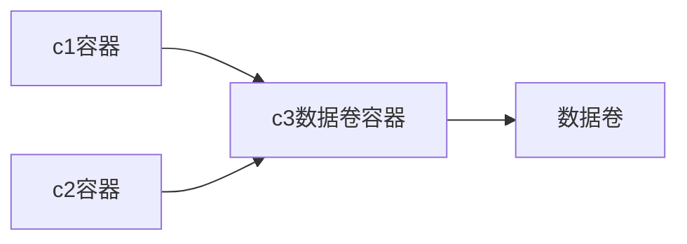

 *完全满足日常使用*

<!-- more -->

### <font color=red>进程相关：</font>


#### 1. 启动docker服务

```shell
systemctl start docker
```

#### 2. 停止docker服务

```shell
systemctl stop docker
```

#### 3. 重启docker服务

```shell
systemctl restart docker
```

#### 4. 查看docker运行状态

```shell
systemctl status docker
```

#### 5. 设置docker开机自启

```shell
systemctl enable docker
```
### <font color=red>镜像相关：</font>

#### 1. 查看镜像：
- 查看本地所有镜像

```shell
docker images
docker images -q   # 查看所用镜像的id
```

#### 2. 搜索镜像：
- 从网络中查找需要的镜像

```shell
docker search 镜像名称
```

#### 3. 拉取镜像：
- 从Docker仓库下载镜像到本地，镜像名称格式为名称:版本号，如果版本号不指定则是最新的版本。
如果不知道镜像版本，可以去docker hub搜索对应镜像查看。

```shell
docker pull 镜像名称
docker pull 镜像名称:版本号
```

#### 4. 删除镜像：
- 删除本地镜像

```shell
docker rmi 镜像id   # 通过id删除本地镜像
docker rmi 镜像名称:版本号 # 通过名称加版本号删除本地镜像
docker rmi docker images -q   # 删除所有本地镜像
```
### <font color=red>容器相关：</font>

#### 1. 创建容器：
- -i: 允许你对容器内的标准输入 (STDIN) 进行交互
 （保持容器一直运行着，否则在没有客户端连接时可能会自动关闭）
- -t: 在新容器内指定一个伪终端或终端
- -d：以守护（后台）模式运行容器。创建一个容器在后台运行，需要使用docker exec 进入容器。退出后，容器不会关闭
- -p：映射端口
- -it 创建的容器一般称为交互式容器，-id 创建的容器一般称为守护式容器
- --name：为创建的容器命名
- 如果要运行的镜像如果不存在，则自动会进行下载

```shell
docker run -it --name=自定义容器名称 镜像名称:版本号 /bin/bash 
#示例：docker run -it --name=c1 centos:7 /bin/bash

docker run -id --name=命名 镜像名称:版本号 /bin/bash 
#后台创建容器，创建之后不会自己进入容器，并且在执行exit之后容器也不会退出
```

```shell
docker run -id -p 宿主机端口:容器端口 --name=自定义容器名称 镜像名称:版本号 /bin/bash 
# 端口映射创建容器
```


#### 2. 进入容器：

```shell
docker exec -it 容器名称 /bin/bash #  退出容器，容器不会关闭
```
#### 3. 退出容器：

```shell
exit
```

#### 4. 停止容器：

```shell
docker stop 容器名称
```

#### 5. 启动容器：

```shell
docker start 容器名称
```

#### 6. 删除容器：
- 如果容器是运行状态则删除失败，需要停止容器才能删除

```shell
shelldocker rm 容器名称

```

```shell
docker rm `docker ps -aq`  # 删除所有容器
```


#### 7. 查看容器信息：

```shell
docker inspect 容器名称
```
#### 8. 查看运行的容器：

```shell
docker ps
docker ps -a #查看历史运行过的容器
```
### <font color=red>数据卷相关：</font>

#### 1. 配置数据卷：
- 目录必须是绝对路径
- 如果目录不存在，会自动创建
- 一个容器可以挂载多个数据卷
- 一个数据卷也可以被多个容器所挂载

```shell
docker run ... –v 宿主机目录(文件):容器内目录(文件) ... 
# 示例：docker run -id --name=c1 -v /root/data:/root/data centos:7 /bin/bash
docker run -it --name=c2 -v /root/data2:/root/data2 -v /root/data3:/root/data3 centos:7 /bin/bash
# 一个容器上可以挂载多个数据卷
```

#### 2. 配置数据卷容器：



- 由于没有指定宿主机的目录，所以会自动创建一个目录做为数据卷，/volume是容器的数据卷（可以自定义命名）
- 通过查看容器信息的命令知道宿主机的数据卷位置

```shell
docker run –it --name=c3 –v /volume centos:7 /bin/bash 
#创建启动c3数据卷容器，使用 –v 参数 设置数据卷
```
- c1、c2容器的数据卷来源c3数据卷容器，就算c3容器挂了，数据卷也可以正常使用

```shell
docker run –it --name=c1 --volumes-from c3 centos:7 /bin/bash
```
```shell
docker run –it --name=c2 --volumes-from c3 centos:7 /bin/bash  
#创建启动 c1 c2 容器，使用 –-volumes-from 参数 设置数据卷
```

### <font color=red>制作自己的镜像文件：</font>

#### 1. 普通制作镜像的方法（了解）：


- ##### 1. 制作镜像

```shell
docker commit 容器id 镜像名称:版本号
```

- ##### 2. 压缩镜像

```shell
docker save -o 压缩文件名称.tar 镜像名称:版本号
```

- ##### 3. 还原镜像

```shell
docker load –i 压缩文件名称
```
#### 2. 使用Dockerfile制作镜像


-  ##### 1.通过dockerfile文件创建镜像

```shell
docker build -f dockerfile文件名 -t 要构建镜像的名称 版本号 .
# 注意：.一定要加，并且前面有空格，用来指定路径的
```


